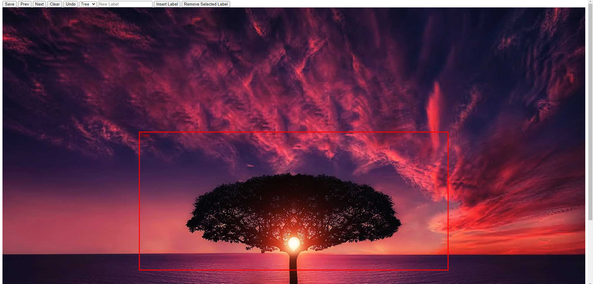

# ImageAnnotator

Annotate images for your machine learning project.



## How to Run
First, do the following:
```
git clone https://github.com/thanosan23/ImageAnnotator.git
cd ImageAnnotator
pip install -r requirements.txt
```

Run the annotate.py file as follows:
```
python annotate.py <path-to-your-dataset>
```

For example, if you want to run the file on the example dataset, you would run:
```
python annotate.py example/example_dataset/images/
```


